<p align="center">
  
</p>

<p align="center">
  <a href="https://github.com/vicrodh/qbz"></a>
  <a href="https://github.com/vicrodh/qbz/releases"></a>
  <a href="https://aur.archlinux.org/packages/qbz-bin"></a>
  <a href="https://snapcraft.io/qbz-player"></a>
  <a href="https://flathub.org/apps/com.blitzfc.qbz"></a>
  <a href="https://github.com/vicrodh/qbz"></a>
  <a href="https://github.com/vicrodh/qbz"></a>
  <a href="https://github.com/vicrodh/qbz"></a>
</p>

<p align="center">
  <a href="https://techforpalestine.org/learn-more"></a>
</p>

# QBZ

QBZ is a free and open source high-fidelity streaming client for Linux (with experimental macOS support) with native playback. It is a real desktop application — not a web wrapper — with DAC passthrough, per-track sample rate switching, exclusive mode, and bit-perfect audio delivery.

No API keys needed. No telemetry. No tracking. Just music.

## Legal / Branding

- This application uses the Qobuz API but is not certified by Qobuz.
- Qobuz is a trademark of Qobuz. QBZ is not affiliated with, endorsed by, or certified by Qobuz.
- **Offline cache** is a temporary playback store for listening without an internet connection while you have a valid subscription. If your subscription becomes invalid, QBZ will remove all cached content after 3 days.
- **Local library** is a "bring your own music" feature — play your own files with bit-perfect audio and the full QBZ interface, no streaming subscription required.
- Qobuz Terms of Service: https://www.qobuz.com/us-en/legal/terms

## Why QBZ

Browsers cap audio output at 48 kHz and resample everything through WebAudio. QBZ uses a native playback pipeline with direct device control so your DAC receives the original resolution — up to 24-bit / 192 kHz — with no forced resampling.

## Installation

### Arch Linux (AUR)

```bash
yay -S qbz-bin    # or paru -S qbz-bin
```

### Flatpak (Flathub)

```bash
flatpak install flathub com.blitzfc.qbz
```

> **Audiophiles:** Flatpak sandboxing limits PipeWire bit-perfect. Use ALSA Direct backend for guaranteed bit-perfect in Flatpak, or install via native packages for full PipeWire support.

### Snap

```bash
sudo snap install qbz-player
sudo snap connect qbz-player:alsa
sudo snap connect qbz-player:pipewire
```

> **Note:** After installing, connect ALSA and PipeWire interfaces for full audio support. MPRIS media keys work out of the box.

### APT Repository (Debian/Ubuntu/Mint)

```bash
curl -fsSL https://vicrodh.github.io/qbz-apt/qbz-archive-keyring.gpg | gpg --dearmor | sudo tee /usr/share/keyrings/qbz-archive-keyring.gpg > /dev/null
echo "deb [signed-by=/usr/share/keyrings/qbz-archive-keyring.gpg arch=$(dpkg --print-architecture)] https://vicrodh.github.io/qbz-apt stable main" | sudo tee /etc/apt/sources.list.d/qbz.list
sudo apt update && sudo apt install qbz
```

> Requires glibc 2.38+ (Ubuntu 24.04+, Debian 13+). For older releases use Flatpak, Snap, or AppImage.

### RPM (Fedora/openSUSE)

Download from [Releases](https://github.com/vicrodh/qbz/releases): `sudo dnf install ./qbz-*.rpm`

> Requires glibc 2.38+ (Fedora 39+, openSUSE Tumbleweed).

### Gentoo

```bash
eselect repository add qbz-overlay git https://github.com/vicrodh/qbz-overlay.git
emerge --sync qbz-overlay
emerge media-sound/qbz-bin    # prebuilt binary
# or
emerge media-sound/qbz        # build from source
```

### NixOS / Nix

Add the flake input to your `flake.nix`:

```nix
inputs.qbz.url = "github:vicrodh/qbz";
```

**NixOS (system-wide):**

```nix
{pkgs, inputs, ...}:
{
  environment.systemPackages = [
    inputs.qbz.packages.${pkgs.system}.default
  ];
}
```

**Home Manager:**

```nix
{pkgs, inputs, ...}:
{
  home.packages = [
    inputs.qbz.packages.${pkgs.system}.default
  ];
}
```

> QBZ is also available in [nixpkgs](https://github.com/NixOS/nixpkgs) as `qbz`.

### AppImage

Download from [Releases](https://github.com/vicrodh/qbz/releases): `chmod +x QBZ.AppImage && ./QBZ.AppImage`

### macOS (Experimental)

> **QBZ is a Linux-first application.** macOS support is experimental and limited. Features like PipeWire, ALSA Direct, casting, and device control are unavailable.

Download the unsigned DMG from [Releases](https://github.com/vicrodh/qbz/releases).

Since the DMG is unsigned, you may need to allow it in System Settings > Privacy & Security after first launch.

## Features

### Audio and Playback

- **Bit-perfect playback** with DAC passthrough and per-track sample rate switching (44.1–192 kHz)
- **Four audio backends:** PipeWire, ALSA, ALSA Direct (hw: bypass), PulseAudio
- **HiFi Wizard** — guided bit-perfect configuration with real DAC capability detection
- Native decoding: FLAC, MP3, AAC, ALAC, WavPack, Ogg Vorbis, Opus (Symphonia)
- Gapless playback on all backends
- **Loudness normalization** (EBU R128) with ReplayGain support
- Two-level audio cache with next-track prefetching
- Streaming playback — start listening before download completes

### Queue and Library

- Queue with shuffle, repeat (track/queue/off), and history
- Favorites and playlists from your Qobuz account
- **Qobuz playlist follow/unfollow** — subscribe natively, syncs across all Qobuz clients
- **Local library** — directory scanning, metadata extraction, CUE sheets, SQLite indexing
- Tag editor with sidecar storage (preserves original files)
- Virtualized lists for large libraries

### Qobuz Connect

Multi-device playback control using Qobuz's real-time streaming protocol.

- **Renderer mode** — receive playback commands from your phone, tablet, or web player
- **Controller mode** — control remote devices from QBZ
- Server-authoritative queue sync across all devices
- Bidirectional transport: play, pause, skip, seek, shuffle, repeat, volume

### Casting

- **Chromecast** and **DLNA/UPnP** discovery and streaming
- Seamless playback handoff to network devices

### Integrations

- **MPRIS** media controls and media keys
- **Last.fm** scrobbling and now-playing
- **ListenBrainz** scrobbling with offline queue
- **MusicBrainz** artist enrichment, musician credits, relationships (no telemetry — one-way pull)
- **Discogs** artwork for local library
- Playlist import from Spotify, Apple Music, Tidal, Deezer
- Desktop notifications with artwork

### Immersive Player

- Full-screen player with tabbed panel system
- **17+ visualization panels:** spectrum, oscilloscope, spectrogram, Linebed (3D terrain), Laser, Tunnel, Comet, coverflow, and more
- Synchronized lyrics with line-by-line display
- Queue, track info, history, and suggestions panels

### Discovery

- **Scene Discovery** — explore artists by location and musical scene (MusicBrainz-powered)
- **3-tab Home:** customizable Home, Editor's Picks, personalized For You
- Genre filtering, artist similarity engine, radio stations
- Musician pages, label pages, album credits

### Interface

- 26+ themes (Dark, OLED, Nord, Dracula, Tokyo Night, Catppuccin, Breeze, Adwaita...)
- Auto-theme from DE, wallpaper, or custom image
- Focus mode, mini player, PDF booklet viewer
- Configurable keyboard shortcuts, UI zoom 80–200%
- **5 languages:** English, Spanish, German, French, Portuguese
- Offline mode with automatic reconnection

## Tech Stack

| Layer | Technology |
|-------|-----------|
| **Desktop shell** | Rust + Tauri 2.0 |
| **Frontend** | SvelteKit + Svelte 5 (runes) + TypeScript + Vite |
| **Audio decoding** | Symphonia (all codecs) via rodio 0.22 |
| **Audio backends** | PipeWire, ALSA (alsa-rs), ALSA Direct (hw:), PulseAudio |
| **Networking** | reqwest (rustls-tls), axum (local API server) |
| **Database** | rusqlite (bundled SQLite, WAL mode) |
| **PDF** | MuPDF 0.6 (native rendering) |
| **Desktop** | souvlaki (MPRIS), ashpd (XDG notifications), keyring |
| **Casting** | rust_cast (Chromecast), rupnp (DLNA/UPnP), mdns-sd |
| **i18n** | svelte-i18n (5 locales) |

### Multi-Crate Architecture

```
crates/
  qbz-models/            Shared domain types
  qbz-audio/             Audio backends, loudness, device management
  qbz-player/            Playback engine, streaming, queue
  qbz-qobuz/             Qobuz API client and auth
  qbz-core/              Orchestrator (player + audio + API)
  qbz-library/           Local library scanning and metadata
  qbz-integrations/      Last.fm, ListenBrainz, MusicBrainz, Discogs
  qbz-cache/             L1 memory + L2 disk audio caching
  qbz-cast/              Chromecast, DLNA/UPnP
  qconnect-protocol/     Qobuz Connect protobuf wire format
  qconnect-core/         Queue and renderer domain models
  qconnect-app/          Application logic and concurrency
  qconnect-transport-ws/ WebSocket transport with qcloud framing
```

## Building from Source

### Prerequisites

- Rust (latest stable), Node.js 20+, Linux or macOS with audio support

### System Dependencies

**Debian/Ubuntu:**
```bash
sudo apt install libwebkit2gtk-4.1-dev libgtk-3-dev libasound2-dev \
  libayatana-appindicator3-dev librsvg2-dev libssl-dev pkg-config
```

**Fedora:**
```bash
sudo dnf install webkit2gtk4.1-devel gtk3-devel alsa-lib-devel \
  libappindicator-gtk3-devel librsvg2-devel openssl-devel pkg-config
```

**Arch Linux:**
```bash
sudo pacman -S webkit2gtk-4.1 gtk3 alsa-lib libappindicator-gtk3 \
  librsvg openssl pkg-config
```

**Gentoo:**
```bash
sudo emerge net-libs/webkit-gtk:4.1 x11-libs/gtk+:3 media-libs/alsa-lib \
  dev-libs/libayatana-appindicator gnome-base/librsvg dev-libs/openssl virtual/pkgconfig
```

### Build

```bash
git clone https://github.com/vicrodh/qbz.git && cd qbz
npm install
npm run tauri dev       # development
npm run tauri build     # production (DEB, RPM, AppImage)
```

### API Proxy (for self-hosted builds)

Pre-built releases include a hosted API proxy for Last.fm, Discogs, Tidal, and Spotify integrations — no API keys needed.

If you build from source and want these integrations, you can either:

1. **Deploy your own proxy** (recommended) — a Cloudflare Worker that securely holds API keys server-side:

```bash
git clone https://github.com/vicrodh/qbz-api-proxy.git
cd qbz-api-proxy
# Add your API keys to wrangler.toml or via `wrangler secret put`
wrangler deploy
```

Then set the proxy URL before building QBZ:

```bash
export QBZ_API_PROXY_URL="https://your-worker.your-account.workers.dev"
npm run tauri build
```

2. **Use direct API keys** — set them in `.env` (see `.env.example`). Keys are embedded at compile time.

> MusicBrainz and Spotify playlist import work without any API keys or proxy.

### Environment Variables

| Variable | Effect |
|----------|--------|
| `QBZ_HARDWARE_ACCEL=0` | Disable GPU rendering (crash recovery) |
| `QBZ_FORCE_X11=1` | Use XWayland (NVIDIA Wayland issues) |
| `QBZ_SOFTWARE_RENDER=1` | Force Mesa llvmpipe (VMs) |
| `QBZ_DISABLE_DMABUF=1` | Disable DMA-BUF (Intel Arc EGL crashes) |

If QBZ crashes on startup: `qbz --reset-graphics`

## Known Issues

- **Hi-Res seeking** — seeking in tracks >96kHz can take 10-20s (decoder must scan from start). Use prev/next for instant navigation.
- **ALSA Direct** — exclusive access blocks other apps. Use DAC/amplifier physical volume control.
- **PipeWire bit-perfect in Flatpak** — limited by sandbox. Use ALSA Direct or native packages.

## Documentation

User guides, audio configuration, integrations, and troubleshooting: **[QBZ Wiki](https://github.com/vicrodh/qbz/wiki)** (work in progress).


## Diagram

```mermaid
flowchart TD

subgraph group_frontend["Frontend"]
  node_ui_shell["Svelte UI<br/>sveltekit app"]
  node_ui_state["Stores & Services<br/>ui orchestration"]
  node_ui_views["Views<br/>screen layer"]
  node_ui_remote["Remote Runtime<br/>qconnect client<br/>[qconnectRuntime.ts]"]
end

subgraph group_tauri["Desktop App"]
  node_tauri_backend["Tauri Backend<br/>native backend"]
  node_cmd_v2["Commands v2<br/>backend api"]
  node_cmd_legacy["Legacy Commands<br/>compat api"]
  node_app_audio["App Audio<br/>backend audio"]
  node_app_player["App Player<br/>playback engine"]
  node_app_library["App Library<br/>library service"]
  node_app_cache["Offline Cache<br/>local cache"]
  node_app_cast["Casting<br/>device handoff"]
  node_app_connect["Qconnect Service<br/>remote control bridge"]
end

subgraph group_crates["Rust Crates"]
  node_rust_player["qbz-player<br/>playback core"]
  node_rust_audio["qbz-audio<br/>audio backend"]
  node_rust_cache["qbz-cache<br/>audio cache"]
  node_rust_qobuz["qbz-qobuz<br/>api client"]
  node_rust_library["qbz-library<br/>library index"]
  node_rust_cast["qbz-cast<br/>cast stack"]
  node_rust_connect["qconnect stack<br/>protocol stack"]
  node_rust_integrations["qbz-integrations<br/>external services"]
end

subgraph group_service["Daemon"]
  node_daemon["qbzd<br/>local daemon"]
end

subgraph group_packaging["Packaging"]
  node_packaging_ci["Packaging & CI<br/>release automation<br/>[workflows]"]
end

node_ui_shell -->|"uses"| node_ui_state
node_ui_shell -->|"renders"| node_ui_views
node_ui_state -->|"calls"| node_cmd_v2
node_ui_state -->|"syncs"| node_ui_remote
node_ui_remote -->|"bridges"| node_app_connect
node_tauri_backend -->|"exposes"| node_cmd_v2
node_tauri_backend -.->|"keeps"| node_cmd_legacy
node_cmd_v2 -->|"drives"| node_app_player
node_cmd_v2 -->|"queries"| node_app_library
node_cmd_v2 -->|"reads/writes"| node_app_cache
node_cmd_v2 -->|"controls"| node_app_cast
node_cmd_v2 -->|"syncs"| node_rust_integrations
node_app_player -->|"uses"| node_rust_player
node_app_audio -->|"uses"| node_rust_audio
node_app_player -->|"prefetches"| node_rust_cache
node_app_library -->|"indexes"| node_rust_library
node_app_library -->|"enriches"| node_rust_qobuz
node_app_cast -->|"delegates"| node_rust_cast
node_app_connect -->|"implements"| node_rust_connect
node_daemon -->|"coordinates"| node_app_player
node_daemon -->|"serves"| node_app_library
node_daemon -->|"hosts"| node_app_connect
node_packaging_ci -.->|"builds"| node_tauri_backend
node_packaging_ci -.->|"packages"| node_daemon
node_packaging_ci -.->|"bundles"| node_ui_shell

click node_ui_shell "https://github.com/vicrodh/qbz/tree/main/src"
click node_ui_state "https://github.com/vicrodh/qbz/tree/main/src/lib/stores"
click node_ui_views "https://github.com/vicrodh/qbz/tree/main/src/lib/components/views"
click node_ui_remote "https://github.com/vicrodh/qbz/blob/main/src/lib/services/qconnectRuntime.ts"
click node_tauri_backend "https://github.com/vicrodh/qbz/tree/main/src-tauri/src"
click node_cmd_v2 "https://github.com/vicrodh/qbz/tree/main/src-tauri/src/commands_v2"
click node_cmd_legacy "https://github.com/vicrodh/qbz/tree/main/src-tauri/src/commands"
click node_app_audio "https://github.com/vicrodh/qbz/tree/main/src-tauri/src/audio"
click node_app_player "https://github.com/vicrodh/qbz/tree/main/src-tauri/src/player"
click node_app_library "https://github.com/vicrodh/qbz/tree/main/src-tauri/src/library"
click node_app_cache "https://github.com/vicrodh/qbz/tree/main/src-tauri/src/offline_cache"
click node_app_cast "https://github.com/vicrodh/qbz/tree/main/src-tauri/src/cast"
click node_app_connect "https://github.com/vicrodh/qbz/blob/main/src-tauri/src/qconnect_service.rs"
click node_rust_player "https://github.com/vicrodh/qbz/tree/main/crates/qbz-player/src"
click node_rust_audio "https://github.com/vicrodh/qbz/tree/main/crates/qbz-audio/src"
click node_rust_cache "https://github.com/vicrodh/qbz/tree/main/crates/qbz-cache/src"
click node_rust_qobuz "https://github.com/vicrodh/qbz/tree/main/crates/qbz-qobuz/src"
click node_rust_library "https://github.com/vicrodh/qbz/tree/main/crates/qbz-library/src"
click node_rust_cast "https://github.com/vicrodh/qbz/tree/main/crates/qbz-cast/src"
click node_rust_connect "https://github.com/vicrodh/qbz/tree/main/crates/qconnect-protocol/src"
click node_rust_integrations "https://github.com/vicrodh/qbz/tree/main/crates/qbz-integrations/src"
click node_daemon "https://github.com/vicrodh/qbz/tree/main/crates/qbzd/src"
click node_packaging_ci "https://github.com/vicrodh/qbz/blob/main/.github/workflows"

classDef toneNeutral fill:#f8fafc,stroke:#334155,stroke-width:1.5px,color:#0f172a
classDef toneBlue fill:#dbeafe,stroke:#2563eb,stroke-width:1.5px,color:#172554
classDef toneAmber fill:#fef3c7,stroke:#d97706,stroke-width:1.5px,color:#78350f
classDef toneMint fill:#dcfce7,stroke:#16a34a,stroke-width:1.5px,color:#14532d
classDef toneRose fill:#ffe4e6,stroke:#e11d48,stroke-width:1.5px,color:#881337
classDef toneIndigo fill:#e0e7ff,stroke:#4f46e5,stroke-width:1.5px,color:#312e81
classDef toneTeal fill:#ccfbf1,stroke:#0f766e,stroke-width:1.5px,color:#134e4a
class node_ui_shell,node_ui_state,node_ui_views,node_ui_remote toneBlue
class node_tauri_backend,node_cmd_v2,node_cmd_legacy,node_app_audio,node_app_player,node_app_library,node_app_cache,node_app_cast,node_app_connect toneAmber
class node_rust_player,node_rust_audio,node_rust_cache,node_rust_qobuz,node_rust_library,node_rust_cast,node_rust_connect,node_rust_integrations toneMint
class node_daemon toneRose
class node_packaging_ci toneIndigo
```



## Open Source

QBZ is MIT-licensed. No telemetry, no tracking, no hidden services. Built for Linux audio enthusiasts, with experimental macOS support.

## Contributing

Contributions welcome. Please read `CONTRIBUTING.md` before submitting issues or pull requests.

### Contributors

- [@vorce](https://github.com/vorce)
- [@boxdot](https://github.com/boxdot)
- [@arminfelder](https://github.com/arminfelder)
- [@afonsojramos](https://github.com/afonsojramos) — macOS port
- [@GwendalBeaumont](https://github.com/GwendalBeaumont) — i18n
- [@AdamArstall](https://github.com/AdamArstall)

## License

MIT

## Fancy charts

<picture>
  <source media="(prefers-color-scheme: dark)" srcset="https://api.star-history.com/chart?repos=vicrodh/qbz&type=date&theme=dark&legend=top-left" />
  <source media="(prefers-color-scheme: light)" srcset="https://api.star-history.com/chart?repos=vicrodh/qbz&type=date&legend=top-left" />
  
</picture>


