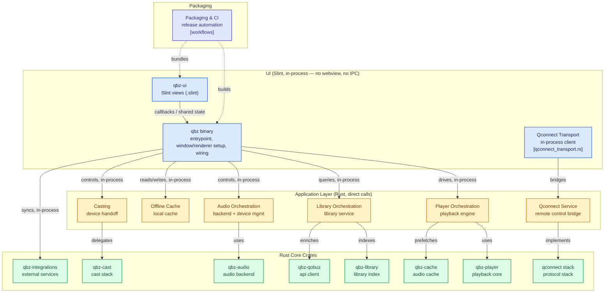

<p align="center">
  
</p>

<p align="center">
  <a href="https://github.com/vicrodh/qbz"></a>
  <a href="https://github.com/vicrodh/qbz/releases"></a>
  <a href="https://aur.archlinux.org/packages/qbz-bin"></a>
  <a href="https://snapcraft.io/qbz-player"></a>
  <a href="https://flathub.org/apps/com.blitzfc.qbz"></a>
  <a href="https://github.com/vicrodh/qbz"></a>
  <a href="https://github.com/vicrodh/qbz"></a>
  <a href="https://github.com/vicrodh/qbz"></a>
</p>

<p align="center">
  <a href="https://techforpalestine.org/learn-more"></a>
</p>

# QBZ

QBZ is a free and open source high-fidelity streaming client for Linux and macOS with fully native playback. As of 2.0, the entire app is a single native Rust process built with a Slint UI — no browser engine, no webview — with DAC passthrough, per-track sample rate switching, exclusive mode, and bit-perfect audio delivery.

No API keys needed. No telemetry. No tracking. Just music.

## Legal / Branding

- This application uses the Qobuz API but is not certified by Qobuz.
- Qobuz is a trademark of Qobuz. QBZ is not affiliated with, endorsed by, or certified by Qobuz.
- **Offline cache** is a temporary playback store for listening without an internet connection while you have a valid subscription. If your subscription becomes invalid, QBZ will remove all cached content after 3 days.
- **Local library** is a "bring your own music" feature — play your own files with bit-perfect audio and the full QBZ interface, no streaming subscription required.
- Qobuz Terms of Service: https://www.qobuz.com/us-en/legal/terms

## Why QBZ

Browsers cap audio output at 48 kHz and resample everything through WebAudio. QBZ uses a native playback pipeline with direct device control so your DAC receives the original resolution — up to 24-bit / 192 kHz — with no forced resampling.

## Installation

### Arch Linux (AUR)

```bash
yay -S qbz-bin    # or paru -S qbz-bin
```

### Flatpak (Flathub)

```bash
flatpak install flathub com.blitzfc.qbz
```

> **Audiophiles:** Flatpak sandboxing limits PipeWire bit-perfect. Use ALSA Direct backend for guaranteed bit-perfect in Flatpak, or install via native packages for full PipeWire support.

### Snap

```bash
sudo snap install qbz-player
sudo snap connect qbz-player:alsa
sudo snap connect qbz-player:pipewire
```

> **Note:** After installing, connect ALSA and PipeWire interfaces for full audio support. MPRIS media keys work out of the box.

### APT Repository (Debian/Ubuntu/Mint)

```bash
curl -fsSL https://vicrodh.github.io/qbz-apt/qbz-archive-keyring.gpg | gpg --dearmor | sudo tee /usr/share/keyrings/qbz-archive-keyring.gpg > /dev/null
cat <<EOF | sudo tee /etc/apt/sources.list.d/qbz.sources
Types: deb
URIs: https://vicrodh.github.io/qbz-apt
Suites: stable
Components: main
Architectures: $(dpkg --print-architecture)
Signed-By: /usr/share/keyrings/qbz-archive-keyring.gpg
EOF
sudo apt update && sudo apt install qbz
```

> Requires glibc 2.39+ (Ubuntu 24.04+, Debian 13+). For older releases use Flatpak, Snap, or AppImage.

### RPM (Fedora/openSUSE)

Download from [Releases](https://github.com/vicrodh/qbz/releases): `sudo dnf install ./qbz-*.rpm`

> Requires glibc 2.39+ (Fedora 40+, openSUSE Tumbleweed).

### Gentoo

```bash
eselect repository add qbz-overlay git https://github.com/vicrodh/qbz-overlay.git
emerge --sync qbz-overlay
emerge media-sound/qbz-bin    # prebuilt binary (recommended)
# or
emerge media-sound/qbz        # build from source
```

> **Source-build warning (yes, even by Gentoo standards):** QBZ's UI compiles
> into one giant generated Rust module — the release build peaks at 20–30 GB
> of RAM and takes a long while (see
> [The memory wall](#-the-memory-wall-read-this-before-your-first-build)).
> Every version bump recompiles it. `qbz-bin` spares you all of that; the
> source ebuild is there for those who enjoy the smell of rustc in the
> morning.

### NixOS / Nix

Add the flake input to your `flake.nix`:

```nix
inputs.qbz.url = "github:vicrodh/qbz";
```

**NixOS (system-wide):**

```nix
{pkgs, inputs, ...}:
{
  environment.systemPackages = [
    inputs.qbz.packages.${pkgs.system}.default
  ];
}
```

**Home Manager:**

```nix
{pkgs, inputs, ...}:
{
  home.packages = [
    inputs.qbz.packages.${pkgs.system}.default
  ];
}
```

> QBZ is also available in [nixpkgs](https://github.com/NixOS/nixpkgs) as `qbz`.

### AppImage

Download from [Releases](https://github.com/vicrodh/qbz/releases): `chmod +x QBZ.AppImage && ./QBZ.AppImage`

### macOS

**QBZ is Linux-first, but as of 2.0 macOS is out of its experimental phase and is a stable, fully supported platform** — a proper player for Linux and Mac. PipeWire, ALSA, and JACK are Linux-specific backends; macOS plays through its own CoreAudio backend, including a Core Audio Direct passthrough path for bit-perfect output. Casting (Chromecast/DLNA) and Qobuz Connect work on macOS as well.

Download the DMG (Apple Silicon or Intel) from [Releases](https://github.com/vicrodh/qbz/releases) and drag QBZ into Applications.

**First launch:** QBZ is ad-hoc signed but NOT notarized (no Apple Developer
subscription), so Gatekeeper will block the first run — and on recent macOS
(Sequoia / 15 and later) the old right-click → Open trick no longer works for
un-notarized apps. Two ways to unlock it, pick one:

- **Settings route:** try to open QBZ once (it gets blocked), then go to
  **System Settings → Privacy & Security**, scroll down to the message that
  QBZ was blocked, and click **Open Anyway**.
- **Terminal route** (what the settings toggle does, minus the clicking):

  ```bash
  xattr -dr com.apple.quarantine /Applications/QBZ.app
  ```

  This removes the quarantine attribute macOS stamps on downloaded files —
  it's a one-time unlock for this copy of the app; updates installed through
  QBZ's own updater don't need it again.

## Features

### Audio and Playback

- **Bit-perfect playback** with DAC passthrough and per-track sample rate switching (44.1–192 kHz)
- **Linux backends:** PipeWire, ALSA (with a Direct hw: bypass mode), PulseAudio, and JACK — all hardened in 2.0, PipeWire/PulseAudio work out of the box
- **macOS backend:** CoreAudio, including a Core Audio Direct passthrough path for bit-perfect output
- **HiFi Wizard** — revamped in 2.0 with real hardware auto-detection and a simpler, guided bit-perfect setup
- Native decoding: FLAC, MP3, AAC, ALAC, WavPack, Ogg Vorbis, Opus (Symphonia)
- **DSD support** — DSF/DFF playback with DSD-to-PCM conversion, DoP, and native DSD passthrough (ALSA)
- Gapless playback on all backends
- **Loudness normalization** (EBU R128) with ReplayGain support
- Two-level audio cache with next-track prefetching
- Streaming playback — start listening before download completes

### Queue and Library

- Queue with shuffle, repeat (track/queue/off), and history
- Favorites and playlists from your Qobuz account
- **Qobuz playlist follow/unfollow** — subscribe natively, syncs across all Qobuz clients
- **Local library** — directory scanning, metadata extraction, CUE sheets, SQLite indexing; usable without ever logging into Qobuz
- **Artist/album blacklist** — block artists or individual albums, not just genres; fully reversible
- Tag editor with sidecar storage (preserves original files)
- Virtualized lists for large libraries

### Qobuz Connect

Multi-device playback control using Qobuz's real-time streaming protocol. Considerably more stable as of 2.0, though full 1:1 parity with the official clients is still in progress.

- **Renderer mode** — receive playback commands from your phone, tablet, or web player
- **Controller mode** — control remote devices from QBZ
- Server-authoritative queue sync across all devices
- Bidirectional transport: play, pause, skip, seek, shuffle, repeat, volume

### Casting

- **Chromecast** and **DLNA/UPnP** discovery and streaming
- Seamless playback handoff to network devices

### Integrations

- **MPRIS** media controls and media keys
- **Last.fm** scrobbling and now-playing
- **ListenBrainz** scrobbling with offline queue
- **MusicBrainz** artist enrichment, musician credits, relationships (no telemetry — one-way pull)
- **Discogs** artwork for local library
- Playlist import from Spotify, Apple Music, Tidal, Deezer
- Desktop notifications with artwork

### Immersive Player

- Full-screen player with tabbed panel system, trimmed and re-tuned in 2.0 to stop being a resource drain
- Multiple full-bleed view modes — Album Reactive, Coverflow, Static, Spectrum, Wave Bed, Lyrics — plus GPU shader scenes (Plasma, Tunnel, Aurora, Spectral Ribbon, Line Bed)
- **Search overlay works inside Immersive mode** — switch albums without leaving the view
- Synchronized lyrics with line-by-line display
- Split-panel layouts: Lyrics, Track Info, Suggestions, Queue

### Discovery

- **Scene Discovery** — explore artists by location and musical scene (MusicBrainz-powered)
- **3-tab Home:** customizable Home, Editor's Picks, personalized For You
- **Recommendations** — Last.fm and ListenBrainz/MusicBrainz-powered discovery based on your listening history, similarities, and local-listen vectorization
- **Live search overlay** with a small cache layer that learns your preferences and stops surfacing results you never touch
- Genre filtering, artist similarity engine, radio stations
- Musician pages, label pages, album credits

### Interface

- 30+ themes (Dark, OLED, Nord, Dracula, Tokyo Night, Catppuccin, Breeze, Adwaita...)
- Auto-theme from DE, wallpaper, or custom image
- Mini player
- Album booklets download to your device — the old in-app PDF reader was dropped in 2.0 to keep the binary lean
- Configurable keyboard shortcuts, UI scale presets (XS–XL)
- **7 languages:** English, Spanish, German, French, Portuguese, Russian, Japanese
- **Offline mode** usable without ever logging into Qobuz, with fully offline playlists and automatic reconnection

## Tech Stack

As of 2.0, QBZ is a single native Rust process: the **Slint UI runs in-process** and talks to the same Rust core crates directly through callbacks and shared state — there is no browser engine, no webview, and no IPC bridge to serialize across (the old Tauri command-invoke boundary is gone entirely).

| Layer | Technology |
|-------|-----------|
| **Desktop shell + UI** | Rust + Slint (native, single process — no webview, no IPC) |
| **Audio decoding** | Symphonia (all codecs) via rodio 0.22 |
| **Audio backends** | Linux: PipeWire, ALSA (alsa-rs, incl. Direct hw:), PulseAudio, JACK. macOS: CoreAudio (incl. Core Audio Direct) |
| **Networking** | reqwest (rustls-tls) |
| **Database** | rusqlite (bundled SQLite, WAL mode) |
| **Desktop** | mpris-server (Linux MPRIS), souvlaki (macOS/Windows media controls), ksni (Linux tray), keyring |
| **Casting** | rust_cast (Chromecast), rupnp (DLNA/UPnP), mdns-sd |
| **i18n** | qbz-i18n, gettext-style `.po` bundles compiled into the binary (7 locales) |

### Multi-Crate Architecture

The Rust workspace lives entirely under `crates/` (manifest `crates/Cargo.toml`); the `qbz` crate is the binary, `qbz-ui` holds the Slint views and view-models. A representative slice of the 36 workspace members:

```
crates/
  qbz/                   Binary crate: app entrypoint, window/renderer setup, wiring
  qbz-ui/                Slint views (.slint) and view-model glue
  qbz-app/               Application-level orchestration (non-UI)
  qbz-theme/             Theme engine (30+ themes)
  qbz-i18n/              Bundled translations (7 locales)
  qbz-models/            Shared domain types
  qbz-audio/             Audio backends, loudness, device management
  qbz-player/            Playback engine, streaming, queue
  qbz-qobuz/             Qobuz API client and auth
  qbz-core/              Orchestrator (player + audio + API)
  qbz-library/           Local library scanning and metadata
  qbz-dsd/               DSD (DSF/DFF) decoding, DoP, native DSD packing
  qbz-plex/              Plex library integration
  qbz-integrations/      Last.fm, ListenBrainz, MusicBrainz, Discogs
  qbz-reco/ qbz-external-reco/  Recommendations engine
  qbz-lyrics/            Lyrics (Qobuz-native, external fallback)
  qbz-mixtape/           Mixtape/DJ-mix generation
  qbz-playlist-import/   Spotify, Apple Music, Tidal, Deezer import
  qbz-media-controls/    MPRIS / SMTC / MPNowPlayingInfoCenter
  qbz-dac-wizard/        HiFi Wizard (hardware auto-detection)
  qbz-cache/             L1 memory + L2 disk audio caching
  qbz-cast/              Chromecast, DLNA/UPnP
  qbz-credentials/ qbz-secrets/  Auth/token storage
  qconnect-protocol/     Qobuz Connect protobuf wire format
  qconnect-core/         Queue and renderer domain models
  qconnect-app/          Application logic and concurrency
  qconnect-transport-ws/ WebSocket transport with qcloud framing
```

## Building from Source

QBZ 2.0 is a pure Rust workspace — there is no Node.js, no `npm install`, no
webview. The workspace manifest is `crates/Cargo.toml`, and the app binary is
the `qbz` crate inside it.

### Prerequisites

- **Rust stable** for a plain `cargo build`, or the **nightly toolchain** if
  you use the repo's build scripts (they pass `-Z threads` to parallelize the
  compiler frontend — see below).
- Linux or macOS with audio support. On Linux the scripts use
  [`mold`](https://github.com/rui314/mold) as linker (install it, or edit the
  `RUSTFLAGS` they set); plain `cargo build` needs neither nightly nor mold.
- No Node.js/npm required.

### System Dependencies

Verified against the project's own Linux CI build (`.github/workflows/build-slint.yml`):

**Debian/Ubuntu:**
```bash
sudo apt install build-essential pkg-config cmake clang libclang-dev nasm \
  libasound2-dev libjack-jackd2-dev libfontconfig1-dev libfreetype-dev \
  libxkbcommon-dev libwayland-dev libxcb1-dev libgl1-mesa-dev libegl1-mesa-dev \
  libdbus-1-dev libssl-dev
```

**Fedora, Arch, Gentoo, and other distros:** package names differ; look for the
equivalents of the Debian list above (a C compiler + clang/libclang, cmake,
nasm, ALSA + JACK dev headers, fontconfig/freetype, Wayland/X11/xkbcommon,
Mesa GL/EGL, D-Bus, and OpenSSL dev headers). Please open a PR if you confirm
exact package names for your distro.

**macOS:** Xcode Command Line Tools (`xcode-select --install`) and a Rust
toolchain — that's it.

### ⚠ The memory wall (read this before your first build)

Slint compiles the entire UI into ONE generated Rust module (~1.6 M lines for
QBZ). A single **release** `rustc` invocation for that crate peaks at
**20–30 GB of RAM**. This is a one-time cost per profile — once the UI crate is
cached, incremental builds are cheap — but the first build WILL hit it, and on
a machine without enough headroom the compiler gets OOM-killed (or worse,
swap-freezes the box).

The knobs that tame it (each lowers peak memory at some compile-time or
runtime-optimization cost):

| Knob | Effect |
|------|--------|
| `CARGO_BUILD_JOBS=1` | one rustc at a time — the single biggest saver |
| `CARGO_PROFILE_RELEASE_CODEGEN_UNITS=256` | smaller codegen chunks (slightly less optimized binary) |
| `CARGO_PROFILE_RELEASE_OPT_LEVEL=2` | opt 2 instead of 3 shaves several GB |
| `-Z threads=1..2` (nightly RUSTFLAGS) | fewer frontend threads = less parallel memory |
| swap | the peak tolerates swap; 16 GB RAM + ~18 GB swap is CI-proven |

**If you have < 32 GB of RAM**, this works on any machine down to ~16 GB
(+ swap) — it is literally the recipe our 16 GB CI runners use; expect it to be
slow (2–3 h from scratch) rather than to fail:

```bash
CARGO_BUILD_JOBS=1 \
CARGO_PROFILE_RELEASE_CODEGEN_UNITS=256 \
CARGO_PROFILE_RELEASE_OPT_LEVEL=2 \
cargo build --release --manifest-path crates/Cargo.toml -p qbz
```

**If you have ≥ 32 GB free**, the plain build is fine and much faster:

```bash
git clone https://github.com/vicrodh/qbz.git && cd qbz
cargo build --release --manifest-path crates/Cargo.toml -p qbz
./crates/target/release/qbz
```

### The convenient way (Linux): `scripts/slint-run.sh`

The repo ships the build script we use ourselves — it reads `MemAvailable`
and picks a tier automatically, so you don't have to think about any of the
above:

| Free RAM | Tier | Settings |
|----------|------|----------|
| ≥ 26 GB | FAST | threads=16, cgu=16, opt=3 — the distribution-grade build |
| 14–26 GB | SAFE | threads=2, cgu=256, opt=3 |
| < 14 GB | MIN | threads=1, cgu=256, opt=2 — slow but never freezes |

```bash
./scripts/slint-run.sh          # build (auto-tier) and run the binary
NORUN=1 ./scripts/slint-run.sh  # build only
FAST=1  ./scripts/slint-run.sh  # force the fast tier (close your apps first)
THREADS=4 CODEGEN_UNITS=128 OPT=3 ./scripts/slint-run.sh  # manual override
```

It requires the nightly toolchain and `mold`. Note that SAFE/MIN produce a
functionally identical but not byte-identical binary vs FAST (different
codegen-units/opt-level), and switching tiers forces a one-time rebuild of the
UI crate.

### Development iteration: release vs fast-debug

Two dev loops, on purpose:

- **`./scripts/slint-dev.sh`** — builds and runs in **release** mode with the
  parallel compiler frontend. This is the default dev loop: runtime
  performance is the whole reason QBZ is a native app, so we always test at
  release perf and a regression can never hide behind "it's just dev mode".
  The binary is the same optimized artifact as `cargo build --release`; only
  compile time improves.
- **`./scripts/slint-dev-fast.sh`** — **debug** build, dramatically faster to
  compile and far lighter on RAM. Use it for purely visual/layout iteration
  where runtime performance does not matter. Never benchmark on it.

On macOS use **`./scripts/slint-dev-mac.sh`** (same intent, Apple-toolchain
flags; works on Apple Silicon and Intel — an 8 GB M-series Mac builds fine,
just slowly, thanks to macOS's aggressive swap).

### Nix / NixOS

`flake.nix` builds the same `qbz` binary via `rustPlatform.buildRustPackage`
(`cargoBuildFlags = [ "-p" "qbz" ]`, root at `crates/`) — see the
[NixOS / Nix](#nixos--nix) install section above, or run `nix build` /
`nix develop` directly from a checkout.

### API Proxy

Last.fm, Discogs, Tidal, Spotify-import, and MusicBrainz traffic goes through a hosted Cloudflare Workers proxy (`qbz-api-proxy.blitzkriegfc.workers.dev`) that holds all credentials server-side. Both pre-built releases and source builds use it out of the box — **no API keys or `.env` file required**.

If you want to run against your own proxy (for development, or if you fork QBZ), the proxy source lives at [`vicrodh/qbz-api-proxy`](https://github.com/vicrodh/qbz-api-proxy). Deploy it with `wrangler deploy` and then edit the `*_PROXY_URL` constants in `crates/qbz-integrations/src/lastfm/client.rs`, `crates/qbz-integrations/src/discogs/mod.rs`, `crates/qbz-playlist-import/src/providers/tidal.rs`, and `crates/qbz-integrations/src/musicbrainz/client.rs` to point at your worker before rebuilding.

### Environment Variables

As of 2.0, QBZ auto-detects a working renderer (GPU wgpu → femtovg/OpenGL → software) at startup across Wayland/X11/Metal, so there is normally nothing to configure. One override remains for diagnostics or a broken GPU stack:

| Variable | Effect |
|----------|--------|
| `QBZ_RENDERER=software` (or `cpu`, `soft`) | Force the software renderer (crash recovery, VMs) |
| `QBZ_RENDERER=gl` (or `gles`, `femtovg`) | Force the femtovg/OpenGL renderer (mid-tier GPUs) |
| `QBZ_RENDERER=wgpu` (or `gpu`, `hardware`, `hw`) | Force the wgpu (GPU) renderer |

If QBZ fails to start, try `QBZ_RENDERER=software qbz` first.

## Known Issues

- **Hi-Res seeking** — seeking in tracks >96kHz can take 10-20s (decoder must scan from start). Use prev/next for instant navigation.
- **ALSA Direct** — exclusive access blocks other apps. Use DAC/amplifier physical volume control.
- **PipeWire bit-perfect in Flatpak** — limited by sandbox. Use ALSA Direct or native packages.
- **DSD DoP / native mode** — seeking is disabled and volume is fixed while a DoP or native-DSD stream is active (any sample manipulation would corrupt the DSD stream). Convert-to-PCM mode has no such limits.

## Documentation

User guides, audio configuration, integrations, and troubleshooting: **[QBZ Wiki](https://github.com/vicrodh/qbz/wiki)** (work in progress).


## Diagram

As of 2.0 there is no webview and no IPC bridge: the Slint UI runs in the same process as the Rust core and calls it directly through callbacks/shared state.



## Open Source

QBZ is MIT-licensed. No telemetry, no tracking, no hidden services. Built for Linux and macOS audio enthusiasts.

## Contributing

Contributions welcome. Please read `CONTRIBUTING.md` before submitting issues or pull requests.

### Contributors

- [@vorce](https://github.com/vorce)
- [@boxdot](https://github.com/boxdot)
- [@arminfelder](https://github.com/arminfelder)
- [@afonsojramos](https://github.com/afonsojramos) — macOS port
- [@Vudgekek](https://github.com/Vudgekek) — macOS audio
- [@GwendalBeaumont](https://github.com/GwendalBeaumont) — i18n
- [@AdamArstall](https://github.com/AdamArstall)
- [@DoubleGate](https://github.com/DoubleGate)

## License

MIT

## Fancy charts

<picture>
  <source media="(prefers-color-scheme: dark)" srcset="https://api.star-history.com/chart?repos=vicrodh/qbz&type=date&theme=dark&legend=top-left" />
  <source media="(prefers-color-scheme: light)" srcset="https://api.star-history.com/chart?repos=vicrodh/qbz&type=date&legend=top-left" />
  
</picture>


